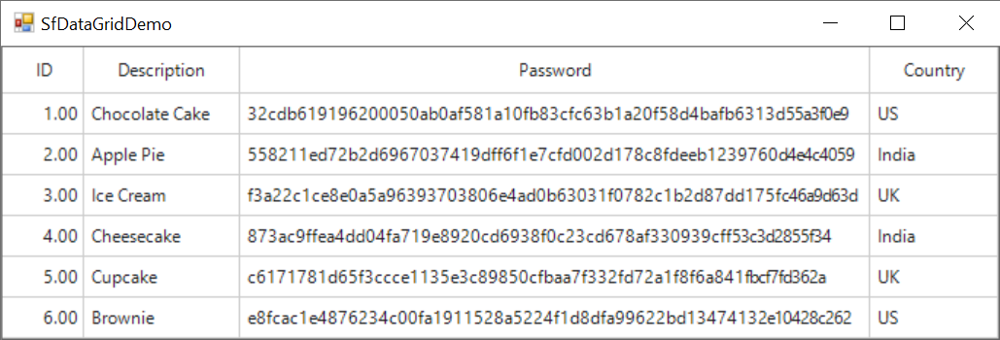

# How to perform hash calculation in WinForms DataGrid

[WinForms DataGrid](https://www.syncfusion.com/winforms-ui-controls/datagrid) (SfDataGrid) does not provide direct support to perform the **Hash** calculation. You can perform the **Hash** calculation by customizing the [CurrentCellValidated](https://help.syncfusion.com/cr/windowsforms/Syncfusion.WinForms.DataGrid.SfDataGrid.html#Syncfusion_WinForms_DataGrid_SfDataGrid_CurrentCellValidated) event with the **SHA256** hash helper method.

```C#

//Event subscription
sfDataGrid1.CurrentCellValidated += OnCurrentCellValidated; 

//Event customization
private void OnCurrentCellValidated(object sender, CurrentCellValidatedEventArgs e)
{
     // Customize based on your requirement
     if (e.Column.MappingName == "Password")
     {
         //Get the current row
         var column = e.RowData as System.Data.DataRowView;
         //Set the Password column value as SHA256 hash
         column["Password"] = GetSHA256Hash((string)e.NewValue);
     }
}

//Helper method to get SHA256 hash
public static string GetSHA256Hash(string input)
{
     using (SHA256 sha256 = SHA256.Create())
     {
         // ComputeHash returns a byte array
         byte[] bytes = sha256.ComputeHash(Encoding.UTF8.GetBytes(input)); 

         // Convert the byte array to a hexadecimal string
         StringBuilder builder = new StringBuilder();

         for (int i = 0; i &lt; bytes.Length; i++)
         {
             builder.Append(bytes[i].ToString("x2")); // "x2" formats as a two-digit hexadecimal number
         }

         return builder.ToString();
     }
}
 ```

The screenshot below illustrates the hash calculation performed in the Password column, 
 
 

Take a moment to peruse the [WinForms DataGrid - Cell Validation](https://help.syncfusion.com/windowsforms/datagrid/datavalidation#cell-validation-2) documentation, where you can find about cell validation with code examples.